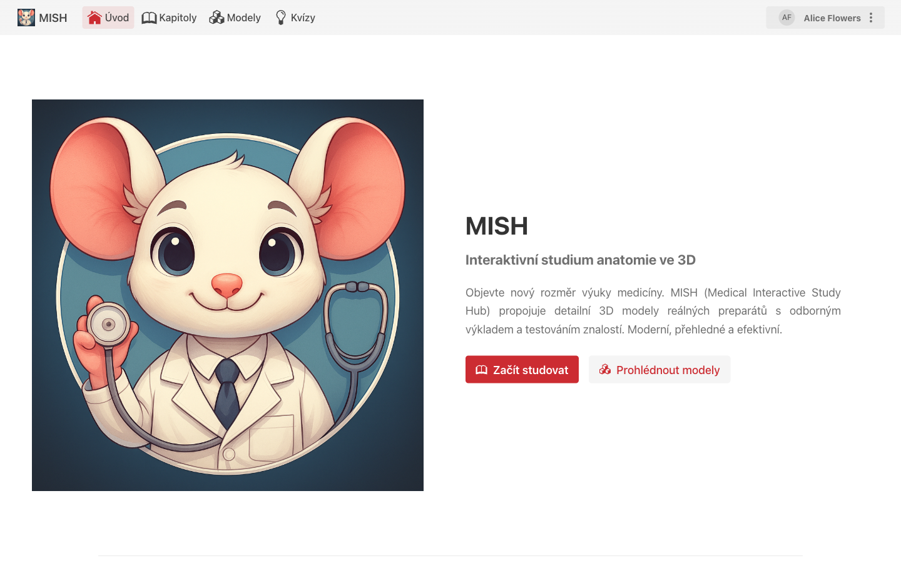
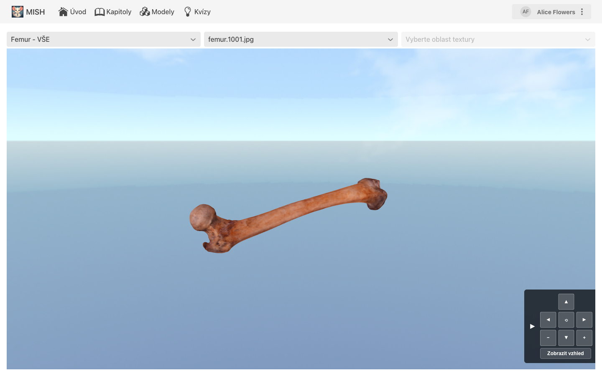
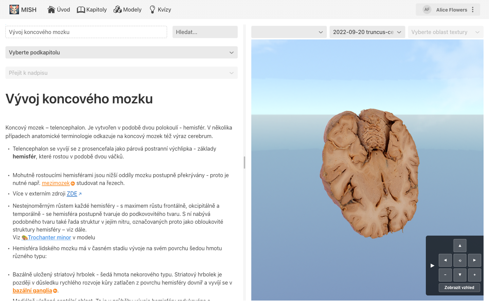
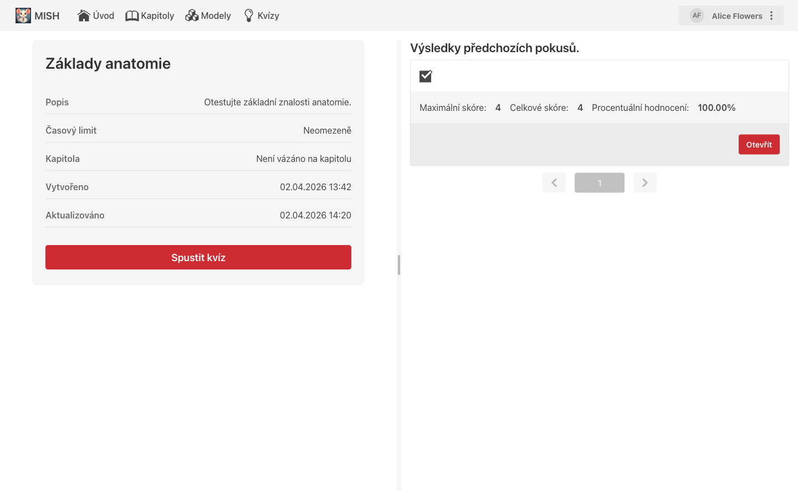
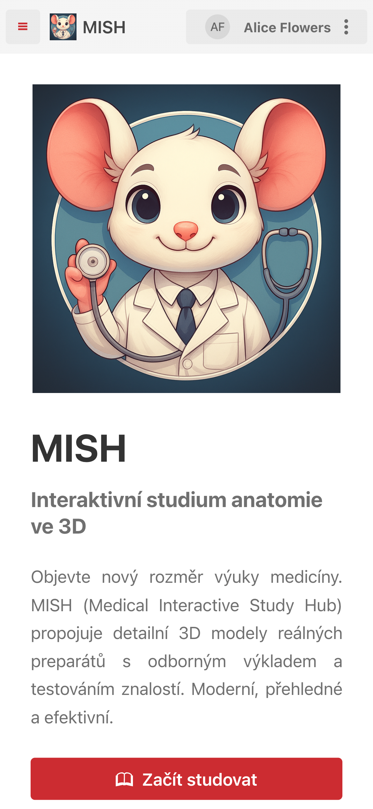
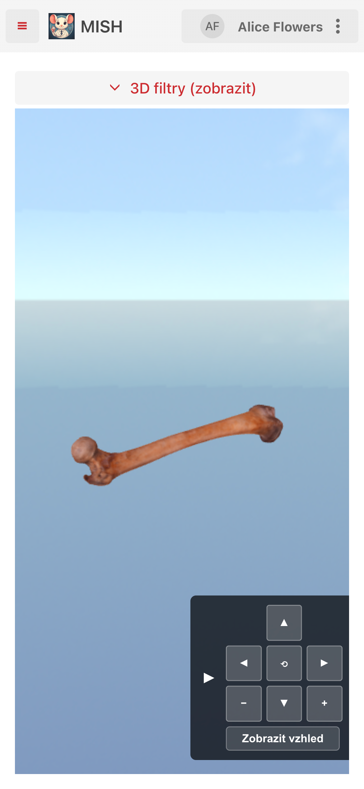
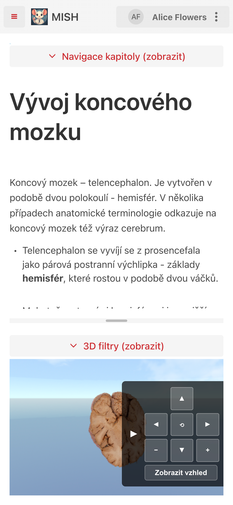
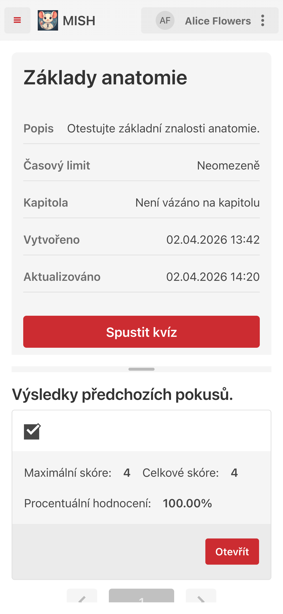

# MISH APP — Frontend


[](https://github.com/zlesak/threejsproofofconcept/actions/workflows/java-tests.yml)
[](https://github.com/zlesak/threejsproofofconcept/actions/workflows/vitest.yml)

## Description

This repository contains the frontend part of the MISH APP application that has been created as a part of a master thesis at the University of Hradec Kralove.  
Provides a web-based user interface for interaction with anatomical 3D models.
Code in this repository is based on Vaadin framework for the UI part and Three.js for 3D rendering.  
The backend part is located in a separate repository: https://github.com/Foglas/mishprototype.

## Running the application

To run the application with back end in action, there has been made a separate repository MISH SCRIPTS making it easy to launch both front end and back end.  
More information can be found in the MISH SCRIPTS repository.  
Link to MISH SCRIPTS repository: https://github.com/zlesak/MISH_SCRIPTS
## Screenshots

### Desktop









### Mobile

| Main page | 3D Model viewer | Chapter detail | Quiz detail |
|-----------|-----------------|----------------|-------------|
|  |  |  |  |

## Testing

### Unit and component tests (Vitest)

```bash
npm run test
```

### E2E tests (Playwright)

```bash
npx playwright test
```

### Three.js canvas performance tests

```bash
npx playwright test e2e/threejs-canvas-perf.spec.ts
```

Results are written to `test-results/threejs-perf-results.json` after each run.

### Java backend tests (Maven)

```bash
./mvnw test
```

## Project structure

```
src/
├── main/
│   ├── java/cz/uhk/zlesak/threejslearningapp/
│   │   ├── api/
│   │   │   ├── clients/          # HTTP clients for backend API communication
│   │   │   └── contracts/        # API request/response DTOs
│   │   ├── application/          # Application layer (use cases, ports, feature modules)
│   │   │   ├── chapter/          # Chapter-related application logic
│   │   │   ├── model/            # Model-related application logic
│   │   │   ├── quiz/             # Quiz-related application logic
│   │   │   ├── threejs/          # Three.js integration and canvas management
│   │   │   ├── common/           # Shared listing, UI helpers
│   │   │   └── ports/            # Input/output port interfaces
│   │   ├── components/           # Reusable Vaadin UI components
│   │   │   ├── buttons/          # Action buttons (create, delete, open, …)
│   │   │   ├── dialogs/          # Confirmation and list dialogs
│   │   │   ├── editors/          # Rich-text and question editors
│   │   │   ├── forms/            # Form components
│   │   │   ├── inputs/           # Selects, file inputs, text fields
│   │   │   ├── listItems/        # Entity card/list-item components
│   │   │   └── quizComponents/   # Quiz renderers and question types
│   │   ├── controllers/          # View controllers (presenter / mediator)
│   │   ├── domain/               # Domain model (entities, value objects, parsers)
│   │   │   ├── chapter/
│   │   │   ├── model/
│   │   │   ├── quiz/
│   │   │   └── texture/
│   │   ├── events/               # Application events (chapter, model, quiz, threejs)
│   │   ├── exceptions/           # Custom exception classes
│   │   ├── i18n/                 # Internationalisation support
│   │   ├── infrastructure/       # Gateway implementations (REST adapters)
│   │   ├── security/             # Keycloak / Spring Security configuration
│   │   ├── services/             # Domain services
│   │   └── views/                # Vaadin views (pages)
│   │       ├── chapter/
│   │       ├── model/
│   │       ├── quizes/
│   │       └── administration/
│   ├── frontend/
│   │   ├── js/                   # Three.js renderer, editor.js and related scripts
│   │   ├── themes/               # CSS themes and styles
│   │   └── types/                # TypeScript type definitions for JS libraries
│   ├── resources/                # Spring application configuration
│   └── webapp/                   # Static web assets (icons, images)
├── test/
│   ├── java/                     # JUnit / Spring integration tests
│   └── …
└── e2e/                          # Playwright E2E and performance tests
```

